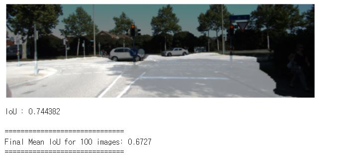
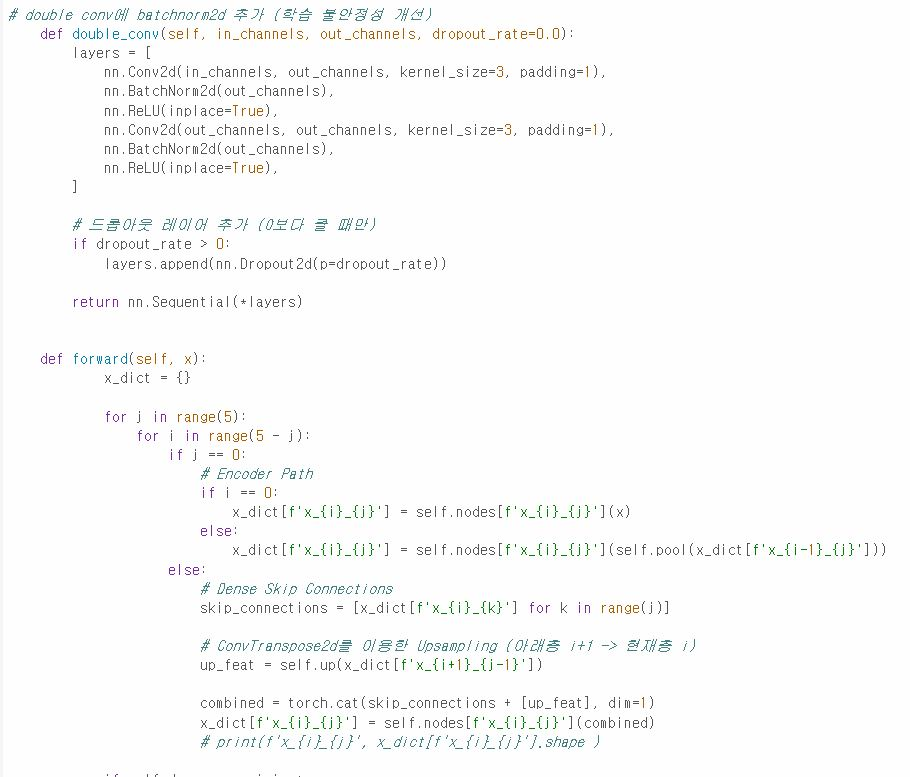
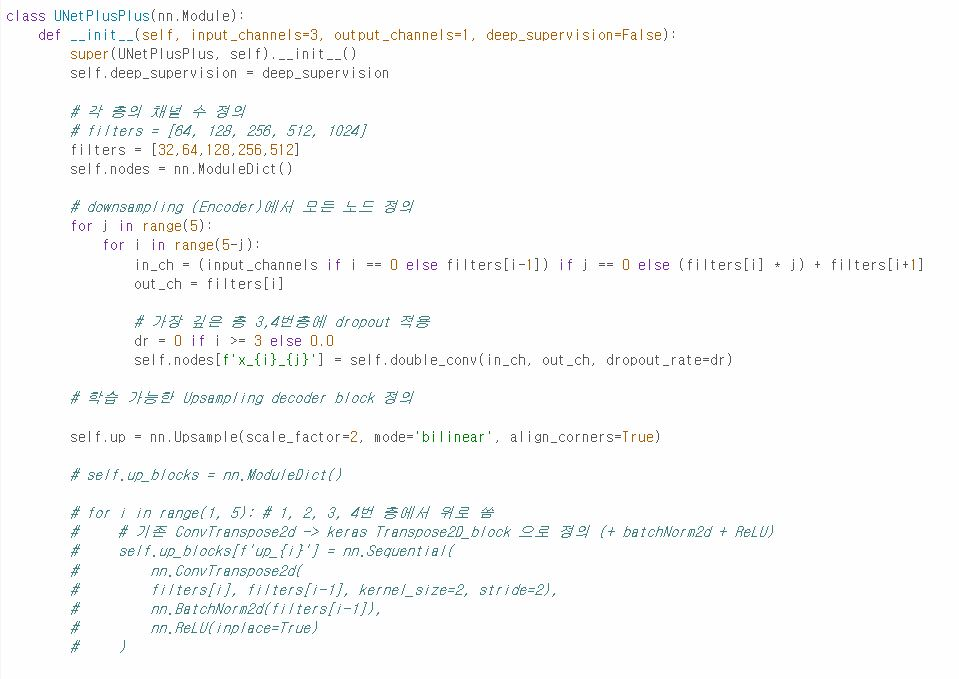
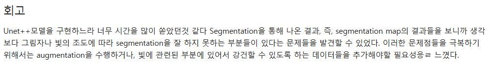
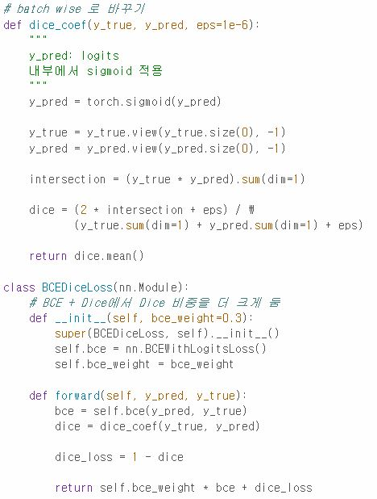

# AIFFEL Campus Online Code Peer Review Templete
- 코더 : 김태경
- 리뷰어 : 김태성


# PRT(Peer Review Template)
- [X]  **1. 주어진 문제를 해결하는 완성된 코드가 제출되었나요?**
    - 문제에서 요구하는 최종 결과물이 첨부되었는지 확인
        - 
        - UNet과 UNet++를 성공적으로 구현하고 학습하였습니다. UNet++에 대한 IoU와 시각화를 통한 정성적 평가를 진행하였지만, UNet의 성능과도 비교하신 것 같지만 명시적으로 기록되지 않아 아쉬웠습니다.
    
- [X]  **2. 전체 코드에서 가장 핵심적이거나 가장 복잡하고 이해하기 어려운 부분에 작성된 
주석 또는 doc string을 보고 해당 코드가 잘 이해되었나요?**
    - 해당 코드 블럭을 왜 핵심적이라고 생각하는지 확인
    - 해당 코드 블럭에 doc string/annotation이 달려 있는지 확인
    - 해당 코드의 기능, 존재 이유, 작동 원리 등을 기술했는지 확인
    - 주석을 보고 코드 이해가 잘 되었는지 확인
        - 
        - 주석을 통해 코드의 기능과 구현 의도에 대해서 잘 작성하였으며, 하이퍼 파라미터를 변경하며 실험했던 내역들을 주석으로 남겨놓았습니다. 
        
- [X]  **3. 에러가 난 부분을 디버깅하여 문제를 해결한 기록을 남겼거나
새로운 시도 또는 추가 실험을 수행해봤나요?**
    - 문제 원인 및 해결 과정을 잘 기록하였는지 확인
    - 프로젝트 평가 기준에 더해 추가적으로 수행한 나만의 시도, 
    실험이 기록되어 있는지 확인
        - 
        - UNet++모델을 구현할때 채널 수를 변경시켜 실험하였습니다.
        - transposed convolution과 bilinear interpolation을 통한 upsampling을 각각 수행하여 실험하였습니다.
        
- [X]  **4. 회고를 잘 작성했나요?**
    - 주어진 문제를 해결하는 완성된 코드 내지 프로젝트 결과물에 대해
    배운점과 아쉬운점, 느낀점 등이 기록되어 있는지 확인
    - 전체 코드 실행 플로우를 그래프로 그려서 이해를 돕고 있는지 확인
        - 
        - 모델이 예측한 segmentation map을 살펴보며 느꼈던 한계점들을 작성하였고, 개선 방안에 고민한 내용을 작성하였습니다.
        
- [X]  **5. 코드가 간결하고 효율적인가요?**
    - 파이썬 스타일 가이드 (PEP8) 를 준수하였는지 확인
    - 코드 중복을 최소화하고 범용적으로 사용할 수 있도록 함수화/모듈화했는지 확인
        - 
        - dice loss를 구현하는 함수에서 단일 샘플 단위로 계산되는 dice_coef 함수를 설계한 뒤, 배치 단위로 연산되도록 BCEDiceLoss를 구현하는 등 기능적 단위로 나눠 함수화 했습니다.


# 회고(참고 링크 및 코드 개선)
```

```
